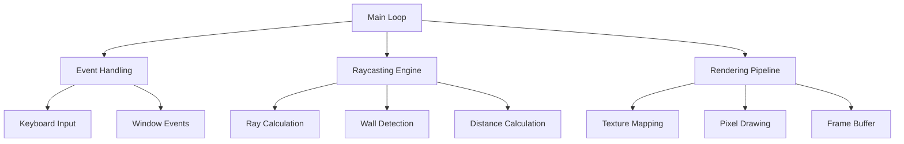

# Cub3D - 3D Raycasting Engine

<div align="center">


**A 3D game engine inspired by Wolfenstein 3D, built from scratch using raycasting techniques**

[Features](#features) • [Installation](#installation) • [Usage](#usage) • [Documentation](#documentation) • [Technical Details](#technical-details)

</div>

## 🎯 Overview

Cub3D is a 3D raycasting engine that creates a first-person perspective game similar to the classic Wolfenstein 3D. This project demonstrates advanced graphics programming concepts, mathematical algorithms, and real-time rendering techniques using the MLX graphics library.

### 🎮 Key Features

- **Real-time 3D Rendering** using raycasting algorithm
- **Textured Walls** with XPM image support
- **Smooth Player Movement** with collision detection
- **Configurable Maps** via .cub configuration files
- **Cross-platform Compatibility** (macOS/Linux)
- **Optimized Performance** for 60+ FPS gameplay


## 🚀 Quick Start

### Prerequisites

- **GCC** compiler with C99 support
- **Make** build system
- **MLX Library** (included)
- **macOS** or **Linux** operating system

### Installation

```bash
# Clone the repository
git clone https://github.com/yourusername/cub3d.git
cd cub3d

# Build the project
make

# Run with a map file
./cub3d maps/test.cub
```

### Controls

| Key | Action |
|-----|--------|
| `W` | Move forward |
| `S` | Move backward |
| `A` | Strafe left |
| `D` | Strafe right |
| `←` | Rotate left |
| `→` | Rotate right |
| `ESC` | Exit game |


## 📁 Project Structure

```
cub3d/
├── 📄 Makefile              # Build configuration
├── 📁 includes/             # Header files
│   └── cube3d.h            # Main header
├── 📁 src/                  # Source code
│   ├── 📁 events/          # Input handling
│   ├── 📁 init/            # Initialization
│   ├── 📁 movement/        # Player movement
│   ├── 📁 parsing/         # File parsing
│   ├── 📁 raycasting/      # 3D rendering
│   ├── 📁 render/          # Graphics output
│   └── 📁 utils/           # Utilities
├── 📁 docs/                 # Documentation
├── 📁 maps/                 # Game maps (.cub)
├── 📁 textures/             # Wall textures (.xpm)
├── 📁 libft/                # Custom C library
└── 📁 mlx/                  # Graphics library
```


## 🎨 Map Configuration

### .cub File Format

```
NO ./textures/north.xpm
SO ./textures/south.xpm
WE ./textures/west.xpm
EA ./textures/east.xpm

F 220,100,0
C 225,30,0

111111
100001
101001
1000N1
111111
```

### Configuration Elements

- **NO/SO/WE/EA**: Texture paths for each wall direction
- **F**: Floor color (RGB format)
- **C**: Ceiling color (RGB format)
- **Map Grid**: 
  - `1` = Wall
  - `0` = Empty space
  - `N/S/E/W` = Player start position and direction


## 🔧 Technical Implementation

### Core Technologies

- **Language**: C (C99 standard)
- **Graphics**: MLX (MiniLibX)
- **Mathematics**: Trigonometry, Linear Algebra
- **Algorithms**: DDA, Raycasting, Texture Mapping

### Architecture Overview



### Performance Metrics

- **Frame Rate**: 60+ FPS
- **Resolution**: 800x600 (configurable)
- **Memory Usage**: < 50MB
- **CPU Usage**: Optimized for real-time rendering


## 📚 Documentation

### Module Documentation

| Module | Description | Documentation |
|--------|-------------|---------------|
| **Events** | Input and window management | [📖 Events Docs](docs/EVENTS_DOCUMENTATION.md) |
| **Movement** | Player movement mechanics | [📖 Movement Docs](docs/MOVEMENT_DOCUMENTATION.md) |
| **Raycasting** | 3D rendering algorithm | [📖 Raycasting Docs](docs/RAYCASTING_DOCUMENTATION.md) |
| **Parsing** | File parsing and validation | [📖 Parsing Docs](docs/PARSING_DOCUMENTATION.md) |
| **Render** | Graphics rendering pipeline | [📖 Render Docs](docs/RENDER_DOCUMENTATION.md) |
| **Init** | System initialization | [📖 Init Docs](docs/INIT_DOCUMENTATION.md) |
| **Utils** | Utility functions | [📖 Utils Docs](docs/UTILS_DOCUMENTATION.md) |

### Complete Project Overview
📋 [**Project Overview**](docs/PROJECT_OVERVIEW.md) - Comprehensive technical documentation


## 🛠️ Build System

### Makefile Targets

```bash
make          # Build the project
make clean    # Remove object files
make fclean   # Remove all generated files
make re       # Rebuild from scratch
make leaks    # Run with memory leak detection
```

### Compilation Flags

- **-Wall -Wextra -Werror**: Strict error checking
- **42 Norm Compliant**: Follows 42 School coding standards
- **Optimized Build**: Performance-focused compilation


## 🧪 Testing

### Map Validation

- ✅ Wall enclosure verification
- ✅ Player position validation
- ✅ Texture file existence
- ✅ Color format validation

### Performance Testing

- ✅ Frame rate monitoring
- ✅ Memory leak detection
- ✅ Input responsiveness
- ✅ Rendering efficiency

### Sample Maps

| Map | Description | Difficulty |
|-----|-------------|------------|
| `simple.cub` | Basic rectangular room | Beginner |
| `complex.cub` | Multi-room layout | Intermediate |
| `maze.cub` | Challenging maze | Advanced |


## 🎯 Learning Objectives

This project demonstrates mastery of:

- **Graphics Programming**: Real-time 3D rendering
- **Mathematical Concepts**: Trigonometry, vector mathematics
- **Algorithm Implementation**: DDA, raycasting
- **Memory Management**: Efficient resource handling
- **System Programming**: Low-level graphics operations
- **Software Architecture**: Modular design patterns

---

## 🤝 Contributing

### Development Guidelines

1. **Follow 42 Norm**: Strict adherence to coding standards
2. **Modular Design**: Keep functions focused and reusable
3. **Error Handling**: Comprehensive error checking
4. **Documentation**: Clear code documentation
5. **Testing**: Validate all changes thoroughly

### Code Style

```c
// Function naming: lowercase with underscores
int	calculate_distance(t_player *player, t_wall *wall);

// Structure naming: s_ prefix for struct, t_ for typedef
typedef struct s_game
{
	void	*mlx;
	void	*win;
	t_img	img;
}	t_game;
```


## 📄 License

This project is part of the 42 School curriculum. Educational use only.


## 🙏 Acknowledgments

- **42 School** for the project specifications
- **MLX Library** developers for the graphics framework
- **Wolfenstein 3D** for the original raycasting inspiration
- **John Carmack** for pioneering 3D graphics techniques


<div align="center">

**Built with ❤️ at 42 School**

[⬆ Back to Top](#cub3d---3d-raycasting-engine)

</div>